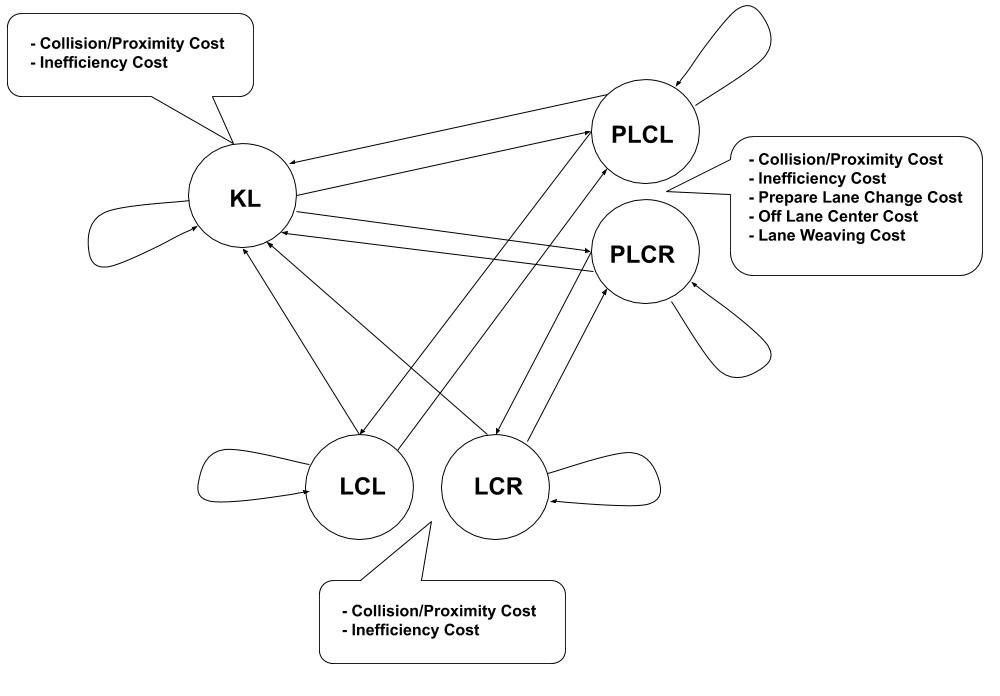

# CarND-Path-Planning-Project
Self-Driving Car Engineer Nanodegree Program
   
This project deals with the self-driving car (Ego) behavior on the highway. The following README dives straight into the
project implementation.  For the proper intro and the info on how to run the project, please refer to
[Udactiy Doc](./README_udacity.md).

## Project Files
* [main.cpp](./src/main.cpp) - Main function interacting with the simulator and calling on Ego class to provide best path.
* [Car.cpp](./src/Car.cpp), [Car.h](./src/Car.h) - the base class representing the vehicles and predicting their path.
* [Ego.cpp](./src/Ego.cpp), [Ego.h](./src/Ego.h) - Ego class inheriting from Car.  It implements the planner.
* [Road.cpp](./src/Road.cpp), [Road.h](./src/Road.h) - The class containing Road characteristics: lane width, number of lanes.
* [helpers.h](./src/helpers.h) - Utility functions mostly from Udacity.  I added a function to calculate circ. track Frenet distance between cars.
* [spline.h](./src/spline.h) - The code adopted to create smooth spline path curves.


## Planner Implementation

As a basis for the path planner, I adopted the ideas from the Udacity lecture: Finite State Machine (FSM) and Cost Functions.
Here's the diagram describing the planner.



There are 5 possible states in the FSM: Keep Lane (KL), Prepare Lane Change Left (PLCL), Prepare Lane Change Right (PLCR),
Lane Change Left (LCL), Lane Change Right (LCR).  Each state has a unique *modus operandi*.
- KL state drives in the same lane keeping some distance behind the car ahead.
- PLCL and PLCR states serve as buffer states between KL and LCL/LCR.  Also, they try to match the velocity of the target change lane before the car starts the actual maneuver.
- LCL and LCR states perform the lane change.
The states are connected by the possible transitions.  In the code, FSM is implemented in Ego.cpp get_possible_successor_states
function [here](https://github.com/dlitvak/CarND-Path-Planning-Project/blob/master/src/Ego.cpp#L246).

Each transition is decided on the basis of the current Ego state and on the basis of the cumulative transition/state costs.
Cumulative state costs are obtained by adding the cost function results (0 - 1 range) multiplied by the corresponding weights.
The successor state that has the lowest cumulative cost becomes the next Ego's state.
The FSM diagram lists the cost functions in the callouts connected to the states.  In the code, you can find these implemented
in Ego.cpp calculate_traj_path_cost function [here](https://github.com/dlitvak/CarND-Path-Planning-Project/blob/master/src/Ego.cpp#L556).

Here is the list of the cost functions and their purposes:
* [inefficiency_cost](https://github.com/dlitvak/CarND-Path-Planning-Project/blob/master/src/Ego.cpp#L570) - decides whether Ego should change the lane based on the estimated lane speeds. 0 - Ego is in the highest lane speed, 1 - the highest speed lane is at the otehr side of the road.
* [collision_and_proximity_cost](https://github.com/dlitvak/CarND-Path-Planning-Project/blob/master/src/Ego.cpp#L614) - looks at the Ego state path and the other car predicted paths (spline lib).  It decides if in the near future there is an imminent collision (1) or a car gets too close to Ego (0 - 1).
* [lane_change_readiness_cost](https://github.com/dlitvak/CarND-Path-Planning-Project/blob/master/src/Ego.cpp#L660) - evaluates how close Ego matches the speed of the lane where it tries to merge. 1 - the target lane speed matches: it's better to go from PLC to LC state.
* [lane_off_center_cost](https://github.com/dlitvak/CarND-Path-Planning-Project/blob/master/src/Ego.cpp#L690) - evaluates the cost of being off center in PLC state.  This was introduced to prevent rapid LC->KL->PLC->LC switching until Ego reaches the middle of the lane in KL state.
* [lane_weaving_cost](https://github.com/dlitvak/CarND-Path-Planning-Project/blob/master/src/Ego.cpp#L711) - time based cost function to limit dangerous weaving between lanes.  It increases PLC cost for a length of time to prevent rapid LC->KL->PLC->LC switching again.

Even though the same cost functions (inefficiency_cost and collision_and_proximity_cost) are applied to multiple states,
the car's behavior is adjusted by the differing cost weights associated with each state.  For e.g. collision cost weight
is higher in LC/PLC than in KL state.  This is in order to encourage Ego to stay in the same lane and lower its speed if a
collision is imminent.

In the code, the cost weights are listed in Ego.h [here](https://github.com/dlitvak/CarND-Path-Planning-Project/blob/master/src/Ego.h#L227).

## Dealing with Excessive Acceleration and Max Out-of-Lane Time Requirements

I started the project by first trying to keep the car driving without collisions not paying attention to acceleration.
After succeeding to drive 340+ miles without collision (I stopped simulation), I thought I was done.  Not so fast!
Measuring the centripetal forces in KL and LC states proved to be as hard as driving without collisions.  The problem was that
I did not know how the simulator measured acceleration.  I had to come up with an estimate mirroring acceleration calculations in the simulator.
In the end, I chose a formula in the lecture Feasibility slide to evaluate the radius of the curve R (1 / curvature K).
K is evaluated as the difference in x-coord divided by difference in yaw between successive Ego path sections.

``` R = 1/K = dx/dphi ```

For each potential Ego state, I used spline library to give me a path.  Then, I applied my curvature calculations to obtain the
centripetal acceleration at each section along the curve.
 ``` AccN = square(Vel_section)/R ```
 The overall path was assigned the maximum centripetal acceleration.  My centripetal acceleration estimates were below what the simulator reported.
 Nevertheless, the estimates had a good correlation with the simulator allowing me to get rid of the risky/uncomfortable lane changing trajectories.
 As a result, Ego might be seen hesitating to change lane in some cases when it thinks the curve is too steep.   In case of KL state,
 Ego might not accelerate as readily when centripetal forces are deemed excessive.

 To contain Ego's acceleration calculations, I introduced a separate class to hold the target velocity variable [TargetV_Controller](https://github.com/dlitvak/CarND-Path-Planning-Project/blob/master/src/Ego.h#L227).
 This class ensures that the target velocity is updated at most once per cycle and that the total acceleration is below 10 m/s^2.

 During the centripetal acceleration calculations of the path, I also calculate the time that Ego would be touching the lane divider.
 I reject any lane changing path that would run over the divider for more than 3 seconds. See the code [here](https://github.com/dlitvak/CarND-Path-Planning-Project/blob/master/src/Ego.cpp#L371).

 ## Conclusion

 Ego consistently drives around 10-20 miles without any major incident.  It changes lanes when it makes sense to do so.
 Albeit, it does so somewhat conservatively due to the comfort and safety considerations.

## Suggestions

- Simulator has a reported bug where Frenet s-coors are reported as 0 about 30 m. before reaching end of the track.  This needs to be fixed.
- It would be of great benefit if we could replay simulator runs with the a different Ego planner code version.  This would allow the students to test the code changes to see how the run has improved.  Currently, we are writing the code against what feels like a random situation generator without an ability to reproduce it.